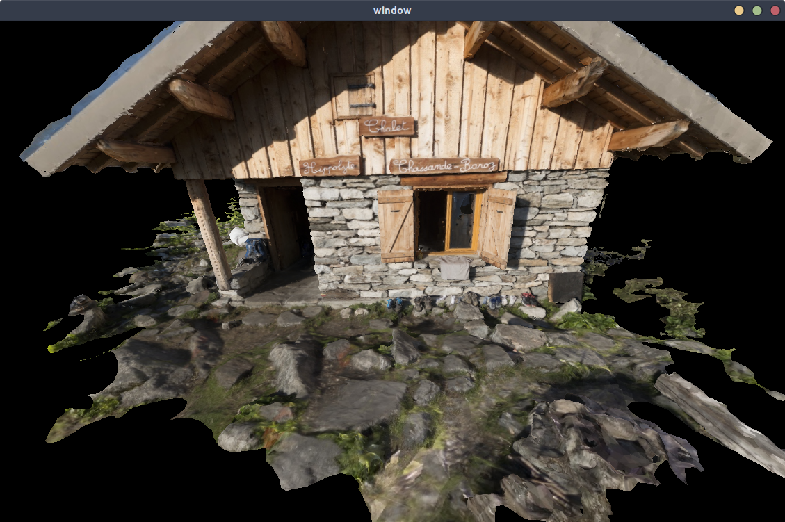

# cw_game

This was made with the fantastic [Vulkan Tutorial](https://vulkan-tutorial.com/)
by Alexander Overvoorde.

## Build requirements

* CMake and a C++ compiler (I have used gcc and MSVC at some point in the project). I also use make on linux.
* All the requirements listed [here](https://vulkan-tutorial.com/Development_environment).

## Example

